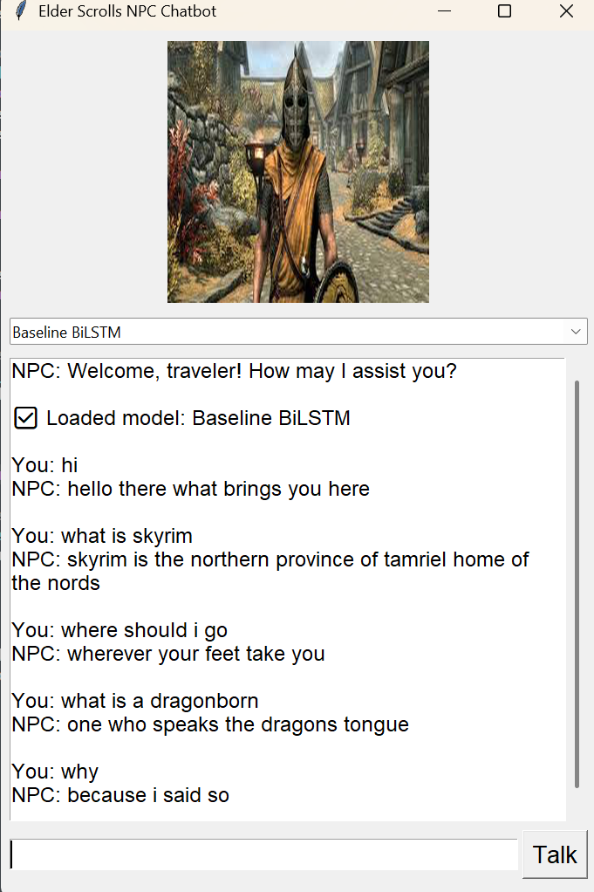

# **🏰 Skyrim GPT Chatbot ⚔️**

This project presents a **machine learning-based NPC (Non-Player Character) chatbot** inspired by **Skyrim**, the iconic open-world RPG. The chatbot generates **context-aware** responses in the conversational style of Skyrim NPCs using deep learning models. The project utilizes three distinct models:

- **Baseline BiLSTM** (Bidirectional Long Short-Term Memory) 🧠
- **BiLSTM with GloVe Embeddings** (Global Vectors for Word Representation) 🔮
- **DistilGPT2** (Distilled version of GPT-2) 🪄

The goal is to build an NPC chatbot capable of generating **immersive, lore-consistent** dialogue in Skyrim's unique conversational style, leveraging advanced **natural language processing (NLP)** techniques.

---
 Demo
 
  

## **📜 Table of Contents**

1. [Models](#Models)
2. [Dataset](#Dataset)
3. [Training](#training)
4. [Results](#results)
5. [Contributing](#contributing)
6. [License](#license)

---

## Models

### **🧙‍♂️ Model 1: Baseline BiLSTM (Learned Embeddings)**
This model processes input dialogue and generates responses using a **BiLSTM architecture**. The BiLSTM model captures contextual relationships by processing the input sequence in both forward and backward directions.

- **Embedding Layer**: Converts words into dense vectors.
- **Bidirectional LSTM Layers**: Capture context from both directions.
- **Dense Layer**: Outputs the predicted word or token.
- **Optimizer**: Adam optimizer with a learning rate of 0.001.

### **🛡️ Model 2: BiLSTM with GloVe Embeddings**
Improving upon the baseline, this model utilizes **pre-trained GloVe embeddings**, offering semantically rich representations of words. This helps the model understand word relationships better, leading to more **contextually accurate** responses.

- **GloVe Embedding Layer**: Uses pre-trained embeddings (300-dimensional).
- **BiLSTM Layers**: Capture both forward and backward context in sequences.
- **Dense Layer**: Produces word predictions based on sequence information.

### **🏹 Model 3: DistilGPT2 (Transformer-based)**
This model uses the **DistilGPT2** transformer architecture. Fine-tuned specifically for Skyrim dialogue, it generates coherent text and understands long-range dependencies within the conversation.

- **DistilGPT2 Decoder**: Processes input using self-attention mechanisms.
- **Fine-Tuning**: Adaptation to Skyrim dialogue.
- **Output Layer**: Generates predictions for the next word in the sequence.

---

## Dataset

### **📝 Dataset Creation:**
The dataset was **generated using an AI model** designed to replicate the **conversational style** and **narrative tone** of **Skyrim NPCs**. Initially, the dataset consisted of **7,565 unique dialogue interactions**, but through the use of **data augmentation techniques**, it was expanded to over **50,000** dialogue interactions. These techniques introduced **conversational variations**, ensuring a broader coverage of topics such as **quests**, **lore**, and **world-building**.

### **📜 Dataset Details:**
- **Size**: The dataset contains **50,000+ dialogue interactions** sourced from Skyrim's vast in-game dialogues.
- **Content**: It includes a variety of conversational themes such as:
  - **Main Quests** 🏰
  - **Side Quests** 🛡️
  - **Character Interactions** ⚔️
  - **Lore and World-building** 📚
  - **Random NPC Dialogue** 🤖

### **🔍 Dataset Generation:**
1. **Extraction**: We collected raw dialogues from Skyrim using **text parsing** and **data scraping techniques**.
2. **Augmentation**: The dataset was expanded through **data augmentation**, which introduced variations to the dialogues, ensuring a more robust dataset that reflects the wide range of conversations in the game.
3. **Guidance**: The dataset was primarily guided by content from the **imperial.json file**, which contains Skyrim’s core lore, ensuring the chatbot’s responses remain **contextually and thematically accurate**.
4. **Formatting**: Each dialogue was formatted into **question-answer pairs**, allowing the model to learn proper conversational flow.
5. **Annotation**: NPC responses were **tagged** to reflect character-specific speech patterns, ensuring the chatbot accurately mimics each NPC’s **voice** and **mannerisms**.

---

## Training

The models were trained on a **custom dataset** designed to replicate **Skyrim NPC dialogues**. The dataset contains over **50,000 dialogue interactions**, enriched with various conversational styles covering quests, lore, and world-building.

### **🔥 Training Process:**
1. **Preprocessing**: Tokenization and padding to convert raw text into a trainable format.
2. **Model Training**: Using **TensorFlow/Keras** or **HuggingFace Transformers**.

### **🛠️ Training Configuration:**
- **BiLSTM and BiLSTM with GloVe**: Trained for **50 epochs** with a **batch size of 64**.
- **DistilGPT2**: Trained for **1 epoch** with a **batch size of 2**.

---

## Results

### **🎯 Model Performance:**

- **Accuracy**: Measures how well the model predicts correct responses during training and validation.

  - **Baseline BiLSTM**:  
    - **Training Accuracy** = 92.52%  
    - **Validation Accuracy** = 91.17%

  - **BiLSTM with GloVe**:  
    - **Training Accuracy** = 91.42%  
    - **Validation Accuracy** = 90.26%

  - **DistilGPT2**:  
    - **Training Loss** = 1.092600 (initial) to 0.236900 (final)

### **⚔️ Perplexity:**
- Lower perplexity indicates better **coherence** in the generated text.

  - **Baseline BiLSTM**:  
    - **Training Perplexity** = 1.38  
    - **Validation Perplexity** = 1.50

  - **BiLSTM with GloVe**:  
    - **Training Perplexity** = 1.50  
    - **Validation Perplexity** = 1.65

### **🔮 Evaluation:**
The models were evaluated on their ability to generate **thematic and contextually accurate dialogue**. The **Baseline BiLSTM** achieved the best results in terms of **training and validation accuracy**, while **DistilGPT2** demonstrated the most **coherent and dynamic responses**.

---

## Contributing

We welcome contributions to improve this project! If you'd like to contribute, please **fork the repository** and submit a pull request with your improvements. We are particularly interested in:

- Extending the dataset with more **Skyrim lore** and dialogues 📚.
- Optimizing model architectures for **faster inference** ⚡.
- Exploring integration with **game engines** like **Unity** or **Unreal Engine** 🎮.

---

## License

This project is licensed under the **MIT License**. See the [LICENSE](LICENSE) file for more details.

---

This project demonstrates the feasibility of creating **immersive NPC chatbots** for RPGs like **Skyrim**, enhancing gameplay experiences through **AI-driven dialogues**. The models used in this project serve as a foundation for future advancements in interactive storytelling in video games.
